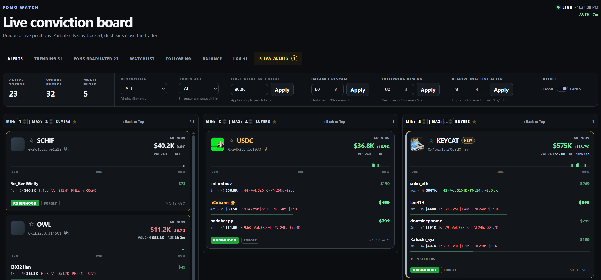

# Fomo.Family Live Conviction Board

Local dashboard for Fomo.Family trading activity, trending tokens and account monitoring.



## Main features

- Live BUY/SELL alerts from Fomo `trading_activity`
- TRENDING board from Fomo `trending_tokens`
- PONS GRADUATED append-only graduation log
- DexScreener enrichment for token age, pair selection and market data
- Watchlist, Following, Balance and Favorite Alerts
- Session LOG with combinable filters
- Configurable buyer lanes, token-age filters and first-alert MC cutoff
- `Remove alerts after` setting, default 60 minutes
- One-click contract copy and direct Fomo token links
- Local dark dashboard with blockchain color coding

## Alerts

- One trader counts once per token.
- Repeated BUYs update the reconstructed position without increasing the unique-buyer count.
- Partial SELLs show the remaining position; dust exits close it.
- Tokens move automatically between buyer-count columns.
- The first accepted BUY market cap is kept as the alert reference.
- `FORGET` removes a token from ALERTS without affecting its TRENDING state.

## Trending

TRENDING uses Fomo's `trending_tokens` WebSocket feed. Fomo provides the live market cap used for display and sorting, while DexScreener provides shared enrichment such as token age and pair metadata.

Filters include search, blockchain, market-cap range, token age and market-cap sorting.

## PONS Graduated

PONS GRADUATED polls the PONS graduation endpoint every 3 seconds and stores new graduations as a persistent log.

Each row shows:

- Date / Time
- Symbol and Name, linked to Fomo
- Pair
- Market cap at graduation
- Graduation duration
- Click-to-copy contract

Newest graduations are shown first. PONS entries are not tracked for live price changes.

## Market data

DexScreener is the main enrichment source for ALERTS and TRENDING.

The optional Fomo `prices` topic is restricted to tokens that are both:

- currently present in ALERTS
- currently held in the authenticated account balance

Price-topic subscriptions are rate-limited and do not affect the main `trading_activity` or `trending_tokens` feeds.

## Following, Balance and Favorites

FOLLOWING and BALANCE are refreshed using the authenticated Fomo account. Favorites are stored locally, highlighted in the dashboard and surfaced in `★ FAV ALERTS`.

## Chrome Bridge

The `chrome_bridge/` extension only:

1. Mirrors the current Fomo access JWT to the local dashboard.
2. Captures the logged-in account `topicId` from Fomo's `trading_activity` subscription.

It does not fetch Balance, Following, TRENDING, PONS or market data.

Install once:

1. Open `chrome://extensions`
2. Enable **Developer mode**
3. Click **Load unpacked**
4. Select the `chrome_bridge/` folder
5. Keep a logged-in Fomo tab open

## Install

```bat
python -m pip install -r requirements.txt
```

## Run

Keep a logged-in Fomo tab open, then run:

```bat
python run.py
```

Open:

```text
http://127.0.0.1:8002
```

## Security

The dashboard is intended to run locally.

`jwt.json` contains a live Fomo session credential and must not be committed or shared. Runtime files such as JWT, account binding, balances, watchlist, favorites, settings, PONS history and session logs should remain excluded from Git.
